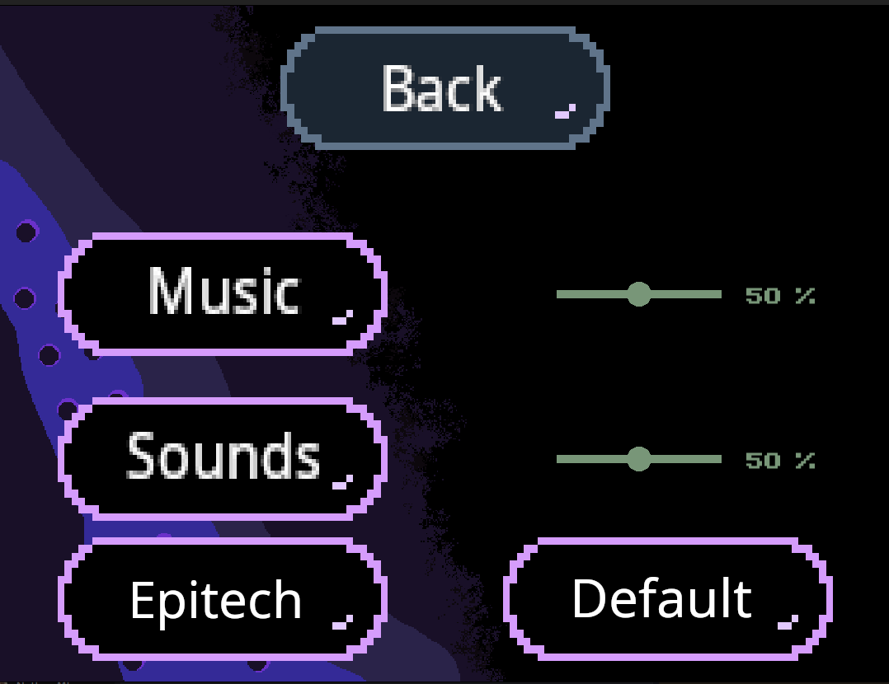
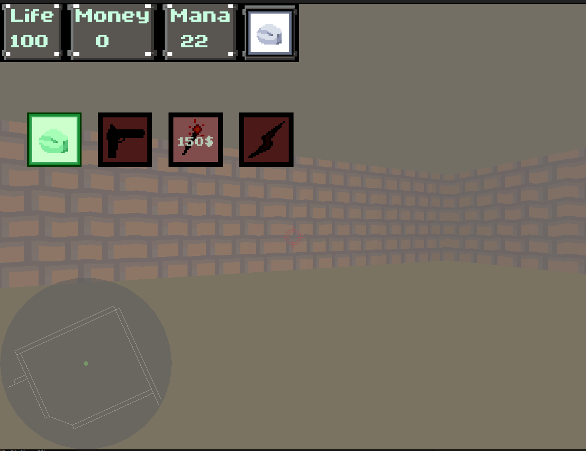

# Kayou

This is from an **Epitech project** called Wolf3D.

Its a five week project from the the second semester of the Epitech **Introduction to Software Engineering module** (**G-ING-210**).

## Project Overview

The goal of this project is to **create a 3D first-person shooter using a simple rendering technique, raycasting**.

The languages used are **C** and **CSFML**.

We've used **OpenGL Shading Language (GLSL)**, for the shaders.


## Epitech Warning

**This is a warning to all epitech students:** 
- **We recall you that being a copycat at EPITECH will not bring you any good.**
- **Copying is totally banned at EPITECH and by not respecting this rule you can be scolded.**

## Prerequisites

- _Make_	    ([Make Library](https://www.gnu.org/software/make/manual/make.html))
- _GCC_         ([gcc Library](https://devdocs.io/gcc~14/))
- _LibC_        ([C Library](https://www.gnu.org/software/libc/))
- _LibCsfml_	([CSFML Library](https://csfml.1l.is/index.html))

## Compilation

- *You can compile the project using the provided Makefile:*

```bash
make
# --> this will create a binary at the root of your repository, named wolf3D.
```

- *To see what you can do with the Makefile, type:*

```bash
make help
# --> this will display every usages of the make command.
```

- *You can compile this binary using:*

```bash
./kayou
# --> to start playing our game.

./kayou godmode
# --> to play the game on god-mode (can't take any damage).

./kayou demo
# --> to launch the demo of the game (tutorial).
```

## KEYBOARD CONTROLS

| Keys | Allow the user to |
| :---------------: | :---------------: |
| "Z", "Q", "S" and "D" | move the player in the game |
| mouse | move the camera |
| "SPACE" or "left click" | shoot with the equiped weapon |
| "E" | to open the shop |
| "R" | change weapon |
| "right click" | lock an ennemy |
| "ESCAPE" | go to the echap menu |
| "A" | Interract with a pnj / Display a text / Exit a text |

## CONTROLLER CONTROLS

| Keys | Allow the user to |
| :---------------: | :---------------: |
| joysticks | move the player in the game and move the camera |
| "R1" | shoot with the equiped weapon |
| key "×" | to open the shop |
| "L1" | change weapon |
| "L2" | lock an ennemy |
| key "○" | Interract with a pnj / Display a text / Exit a text |
| "OPTIONS" | go to the echap menu |
| joystick left | navigate trought menus |
| joystick right | change volume in the option menu |

## MENU

**The menu Options allow the user to change some settings.**



*The settings are the following ones:*

| "Music" | Allow the user to change the intensity of the music |
| :---: | :---: |
| "Sounds" | Allow the user to change the intensity of the sounds |
| "Default" | The regular texture pack of the game |
| "Epitech" | A special Epitech texture pack for the game |


## USER INTERFACE:

**When in game, in the top left of the window, you can see the user informations.**



| What is it? | What is it for? |
| :---------------: | :---------------: |
| Life | When it drops to 0 the user die, and its a game over. |
| Money | When pressing "E", it allow the user to purchase weapons. |
| Mana | Each magic weapon consume mana to be used. When the user don't have enought mana to use it, the weapon became inneficient. |
| Weapon | By going in the shop, the user can select a wepon to use (or change it by pressing "R") |

*There is also a minimap at the bottom left of the window.*

## In-Game Informations:

**In game, you can founds items on the ground, or by defeating ennemy.**

| Color | Effect |
| :---------------: | :---------------: |
| Green Crystal | A crystal of life, granting heal to the player |
| Grey Gem | A gem of mana, granting mana to the player |
| Yellow Coins | A gold coin, granting money to the player |

**When playing, the game autosave when the player goes to another room.**

**This game contain many secrets, like secrets rooms, secret boss, so don't hesitate to throw stones on walls.**

**You can find our game lore right here:**

- [Kayou's Lore](./Kayou_lore/)

## Authors

| [<br><sub>Tanguy Folliot</sub>](https://github.com/jf1Phillips) |
| :---: |
| [<br><sub>Quentin Dutournier-Ottenin</sub>](https://github.com/Patate-with-computer) |
| [<br><sub>Nicky Truong</sub>](https://github.com/Ry0s43b4) |
